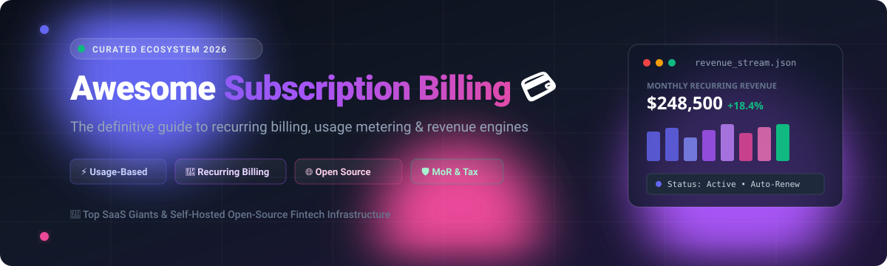
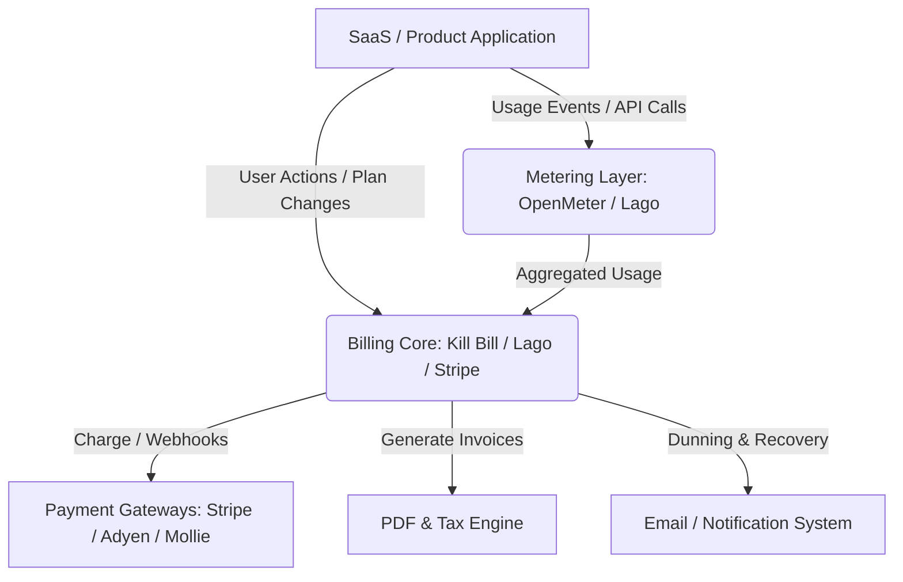

# 💳 Awesome Subscription Billing 🚀

  

### 🌟 Curated List of Top SaaS Platforms & Open-Source Subscription Infrastructure 🛠️

*A definitive guide for Recurring Billing, Usage-Based Pricing, Invoicing, Metering, Dunning, Merchant of Record (MoR), and Revenue Operations.*

**Last updated: August 2026** 📅

---

## 📖 Overview

Welcome to the ultimate directory of **Subscription Billing** and **Usage-Based Monetization** engines! 📊

Modern digital companies, SaaS startups, AI platforms, and enterprise scaleups require robust billing architectures to power:
- 🔁 **Recurring & Tiered Billing**: Multi-cycle subscription models, trial management, upgrades/downgrades, and proration.
- ⚡ **Usage-Based & Metered Pricing**: Real-time event ingestion, aggregation engines, and token/API consumption rating.
- 💸 **Payment Recovery & Dunning**: Smart retries, automated payment reminders, and churn reduction workflows.
- 🧾 **Invoicing & Taxation**: Global VAT/GST compliance, PDF generation, and Merchant of Record (MoR) fulfillment.
- 📈 **Revenue Operations & Analytics**: MRR, ARR, churn, cohorts, and automated revenue recognition.

---

## 📑 Table of Contents

- [🏢 SaaS & Hosted Platforms](#-saas--hosted-platforms)
- [🌐 Open-Source GitHub Projects](#-open-source-github-projects)
- [🧩 Specialized Open Billing Components](#-specialized-open-billing-components)
- [🏗️ Architectural Blueprints](#-architectural-blueprints)
- [🤝 How to Contribute](#-how-to-contribute)
- [⭐ Star History](#-star-history)
- [⚠️ Disclaimer](#-disclaimer)

---

## 🏢 SaaS & Hosted Platforms

A comprehensive comparison of top commercial and hosted subscription billing platforms, sorted in descending order by **Company Scale (Valuation / Annual Revenue)**.

| Platform | Scale (Valuation / Revenue) 📊 | Description 📝 | Pricing (Starting Tier) 💵 | Free Tier / Free Trial Limits 🎁 |
| :--- | :--- | :--- | :--- | :--- |
| **[Stripe Billing](https://stripe.com/billing)** | **~$159B Valuation** (~$6.8B Annual Revenue) | Developer-first billing engine integrated directly with Stripe Payments, supporting recurring subscriptions, usage-based metering, and flexible revenue models. | **Pay-as-you-go:** 0.7% on recurring billing volume (plus standard card processing fees of 2.9% + $0.30) | **Free Tier:** 25 free invoices per month on Stripe Invoicing; unlimited free integration in sandbox/test mode |
| **[Chargebee](https://www.chargebee.com/)** | **~$3.5B Valuation** (~$202M Annual Revenue) | Leading subscription management and monetization platform for mid-market and enterprise SaaS, supporting complex plans, usage pricing, dunning, and revenue recognition. | **Starter:** Free up to $250k cumulative billing; **Performance:** $599/mo (includes up to $100k/mo billing + 0.75% overage) | **Free Plan:** Free for first $250,000 in cumulative billing (0.75% overage on additional volume); 14-day free trial on paid plans |
| **[Zuora](https://www.zuora.com/)** | **~$1.7B Valuation** (~$450M Annual Revenue) | Enterprise quote-to-cash and subscription billing system of record designed for large-scale, multi-product revenue operations. | **Enterprise:** Starts at ~$75,000/year (custom quote-based contracting tailored to subscriber and billing volume) | **Free Trial:** 30-day sandbox trial upon sales request; free access to Zuora University Essentials training courses |
| **[Paddle](https://www.paddle.com/)** | **~$1.4B Valuation** (~$91M ARR) | All-in-one Merchant-of-Record (MoR) platform that handles checkout, payments, global sales taxes, and compliance for software and digital goods. | **Pay-as-you-go:** 5% + $0.50 per successful transaction (no recurring monthly platform fees) | **Free Sandbox:** Unlimited free sandbox & developer environment for building and testing; no permanent free live processing tier |
| **[FastSpring](https://fastspring.com/)** | **~$500M+ Valuation** (~$100M+ Annual Revenue) | Global e-commerce and subscription platform acting as a Merchant of Record with built-in tax remittance, fraud mitigation, and checkout localization. | **Standard:** ~3.9%–8.9% + $0.95 per transaction (custom quote-based MoR model, no fixed monthly subscription fee) | **Free Trial:** 14-day trial account / demo access with full dashboard access to test checkout and store setup |
| **[Recurly](https://recurly.com/)** | **~$300M+ Valuation** (~$56M Annual Revenue) | High-velocity subscription billing platform optimized for subscriber retention, automated billing workflows, and intelligent payment recovery. | **Starter:** $249/mo (includes first $40k/mo billing volume + 0.9% overage); **All-Access:** Custom enterprise quote | **Free Trial:** 90-day free trial on Starter plan with full feature testing (no permanent free live tier) |
| **[Maxio](https://www.maxio.com/)** | **~$250M+ Valuation** (~$49M ARR) | Billing and financial operations platform for B2B SaaS, combining subscription billing with advanced SaaS metrics, cohort analytics, and revenue recognition. | **Grow:** $599/mo (for businesses with up to $100k/mo billing volume); **Scale:** Custom enterprise quote | **Free Trial:** 14-day trial / demo access upon request; free developer test sandbox with no time limit (purged after 120 days inactivity) |
| **[Chargify (Maxio)](https://www.maxio.com/)** | **Merged under Maxio** (Part of $49M ARR) | Elastic recurring billing platform known for flexible multi-attribute subscription management, developer APIs, and usage rating. | **Grow:** $599/mo (includes up to $100k/mo billing volume); **Scale:** Custom enterprise quote | **Free Trial:** 14-day trial / demo sandbox; free developer testing environment with full API access |
| **[Billsby](https://www.billsby.com/)** | **~$10M–$20M Valuation** (~$2.2M Annual Revenue) | Subscription billing platform focused on simplicity, transparent tier setups, and rapid deployment for growing subscription businesses. | **Core:** $45/mo (includes up to $15k/mo revenue + 0.4% overage); **Pro:** $135/mo (includes up to $15k/mo revenue + 0.5% overage) | **Free Plan:** $0/mo Free testing and configuration plan (unlimited time/users before launch); 14-day free trial on live tiers |

---

## 🌐 Open-Source GitHub Projects

Self-hosted and developer-first open-source subscription and usage billing systems, sorted in descending order by **GitHub Stars (★)**.

- **[Lago](https://github.com/getlago/lago)**   
  🚀 **Open-source metering and usage-based billing infrastructure.** Designed as a direct, self-hostable alternative to Chargebee and Stripe Billing. Manages complex pricing models (pay-as-you-go, prepaid credits, tiered subscriptions), usage event ingestion, invoicing, and integrations with payment gateways like Stripe, Adyen, and GoCardless.

- **[Kill Bill](https://github.com/killbill/killbill)**   
  ⚡ **The enterprise-grade open-source subscription billing and payments platform.** Over a decade in production across fintech and Fortune 500 companies. Provides end-to-end plan cataloging, multi-tenancy, invoice generation, customized dunning workflows, payment gateway plugins, and high-throughput scalability. *Apache 2.0 Licensed*.

- **[Flexprice](https://github.com/flexprice/flexprice)**   
  💡 **Open-source billing and monetization engine for modern SaaS.** Built for AI and API-first business models, offering credit systems, real-time usage metering, entitlement checks, modular pricing rules, and seamless payment sync.

- **[Autumn](https://github.com/useautumn/autumn)**   
  🍂 **Open-source pricing and billing layer for Stripe.** Acts as a smart layer between your application code and Stripe, providing out-of-the-box feature gating, usage tracking, and entitlement enforcement without writing custom billing webhooks.

- **[OpenMeter](https://github.com/openmeterio/openmeter)**   
  ⏱️ **Cloud-native, real-time usage metering engine.** Tailored for AI, LLM token tracking, API consumption, and infrastructure-as-a-service billing with millisecond latency and high-volume event aggregation.

- **[FOSSBilling](https://github.com/FOSSBilling/FOSSBilling)**   
  🛡️ **Free and open-source billing, client management, and ticketing solution.** Lightweight and modular, widely used for hosting platforms, domain management, and digital subscription services.

- **[Meteroid](https://github.com/meteroid-oss/meteroid)**   
  📈 **Open-source pricing, billing, and CPQ engine for product-led growth.** Covers usage event processing, custom pricing configurations, invoice workflows, and real-time revenue analytics.

- **[Tier](https://github.com/tierrun/tier)**   
  📦 **Developer toolkit and SDK for pricing and entitlement management.** Allows developers to define SaaS pricing models in a single `pricing.json` file and automate Stripe Billing synchronization.

- **[Servicebot](https://github.com/service-bot/servicebot)**   
  🤖 **Open-source subscription management and embeddable customer portal.** Links SaaS service templates directly to Stripe, providing user authentication, embeddable pricing tables, and automated invoice delivery.

- **[BillaBear](https://github.com/billabear/billabear)**   
  🐻 **Self-hosted subscription management and tax/invoicing engine for Stripe.** Gives teams granular control over recurring billing, custom invoice templates, email workflows, and multi-currency dunning.

---

## 🧩 Specialized Open Billing Components

- 📥 **Event Ingestion & Metering Pipelines**: High-throughput message queues (Kafka, NATS, ClickHouse) configured for usage event collection.
- 📄 **Invoice & Document Generators**: Headless Chromium / PDF engines configured for generating tax-compliant financial invoices.
- 🔁 **Smart Dunning & Payment Recovery Scripts**: Event-driven worker routines implementing exponential backoff retries and webhook alerts.
- 📊 **Self-Hosted Subscription Trackers**: Internal admin dashboards and tools for tracking organizational software spend and recurring subscriptions.

---

## 🏗️ Architectural Blueprints

### Self-Hosted vs. Managed Billing Matrix

---

## 🤝 How to Contribute

Contributions are warmly welcomed! Help keep this fintech directory up to date:

1. 🍴 Fork the repository.
2. 📝 Add or edit entries in `README.md` (ensure adherence to tabular SaaS formatting and star badges for OSS projects).
3. 🔍 Ensure descriptions are accurate, objective, and link directly to official documentation or source repositories.
4. 🚀 Submit a Pull Request with a concise summary of your changes.

---

## 📈 Star History

---

## ⚠️ Disclaimer

- This repository is a **community-curated index** for informational and educational purposes.
- Billing systems handle sensitive financial data, payments, and tax records. When deploying self-hosted software, ensure rigorous PCI-DSS compliance, data encryption, and financial audit verification.
- Always consult localized financial and legal advisory when configuring global tax collection (VAT/GST/Sales Tax) and consumer cancellation policies.

---

Made with ❤️ for SaaS Founders, Billing Engineers, and Revenue Operations Teams.

